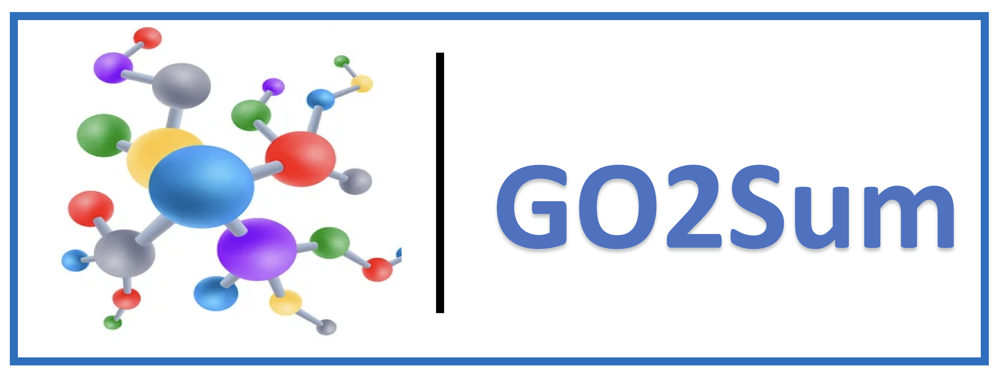

# GO2Sum

<a href="https://github.com/marktext/marktext/releases/latest">
   
   
   
   
   
</a>      <br>


GO2Sum is a deep learning based summarizer that generates human-readable summaries for GO term annotations made by protein function prediction methods.

Copyright (C) ------

License: GPL v3. (If you are interested in a different license, for example, for commercial use, please contact us.) 

Contact: Daisuke Kihara (dkihara@purdue.edu)

For technical problems or questions, please reach to Swagarika J Giri (giri2@purdue.edu).

## Pre-required software
Python 3.9 : https://www.python.org/downloads/    

## Installation  
### 1. [`Install git`](https://git-scm.com/book/en/v2/Getting-Started-Installing-Git) 
### 2. Clone the repository in your computer 
```
git clone https://github.itap.purdue.edu/kiharalab/GO2Sum.git && cd GO2Sum

```
### 3. Create a new environment and activate it
#### Install anaconda
#### 3.1 [`install conda`](). 

#### 3.2 create a new environment go2sum and activate it
```
conda create --name go2sum python=3.9
conda activate go2sum
```
Each time when you want to run this code, simply activate the environment by

```
conda activate go2sum
conda deactivate    (If you want to exit) 
```
### 4. Build dependencies.  
#### GO2SUM is based on simpleT5, a Pytorch-lightning implementation of T5 model
#### Install with pip and python.
```
pip install --upgrade simplet5

```
### 5. Prepare Data
Please download and unzip the models.zip files

[https://kiharalab.org/GO2Sum/](https://kiharalab.org/GO2Sum/)
<!-- need to make server hosting the data -->

### 6. Usage

#### Use GO2Sum to generate summary from annotated goterms
```
python3 main.py

            --input_file  ('Tab-separated file with Protein ID and GO Annotation list')

            --summary_type' ('Type of summary to generate :function, subunit, pathway, or all)

            --output_file ('Name of result file')
```
#### To use the script, follow these steps
#### 6.1 Create a tab-separated input_file in the following format

```
Protein	GO_IDs
Q5AK66	GO:0000139;GO:0004609;GO:0005795;GO:0006646;GO:0006656;GO:0006659;GO:0010008;GO:0016540;GO:0036170;GO:0036171;GO:0036180;GO:0046872
A9AJN2	GO:0004609;GO:0005886;GO:0006646
```
Each row should correspond to a single protein and its associated GO IDs. The first column should contain the protein name, and the second column should contain a semicolon-separated list of GO IDs.

`Sample input files named test1.tab and test.tab is provided in the test/ directory for ur reference.`

#### 6.2 Run the script using the following command
```
python3 main.py 

                --input_file <path_to_input_file> 

                --summary_type <summary_type> 

                --output_file <output_file_suffix>

```
Replace `<path_to_input_file>` with the path to your input file,` <summary_type>` with one of the following options: `function, pathway, subunit, or all` and `<output_file_suffix>` with the suffix you want to use for the output file.

#### 6.3 Example 

For example, if your input file is named test1.tab, and you want to generate a summary of the function for each protein and save the output file with the suffix `example`, you would run the following command:

Example 1
```
python3 main.py --input_file test1.tab --summary_type function --output_file example

```
This would generate the output files `function_example.tab` in the `result` directory.

Example 2
```
python3 main.py --input_file test1.tab --summary_type all --output_file example

```
This would generate the output files `function_example.tab, subunit_example.tab, and pathway_example.tab` in the `result` directory.


## Experiments

All the codes to run the experiments are provided in /Experiments directory


## Citation:

"GO2Sum: Generating Human readable functional summary from GO terms, Swagarika J Giri, Nabil Ibtehaz,  and Daisuke Kihara, In submission (2023)"

